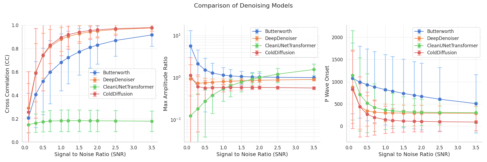
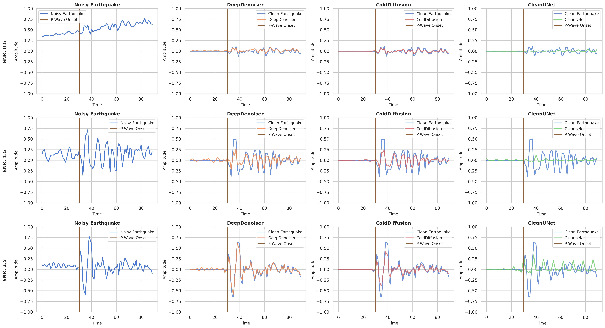

# README: AI-Powered Earthquake Denoising 

## Overview 

This project was undertaken as part of the Data Science Lab course at ETH Zurich. The data for this project was provided by the Swiss Seismological Service (SED) and consists of earthquake and noise signals recorded in Switzerland. The goal of this project was to develop and evaluate deep learning approaches to effectively filter out noise from noisy earthquake signals. A key focus was on improving the detection of small-magnitude earthquakes, which are particularly important in Switzerland due to their prevalence.


## Table of Contents
1. [Setup](#setup)
2. [Methods](#methods)
    - [Dataset](#dataset)
    - [Metrics](#metrics)
    - [Models](#models)
3. [Usage](#usage)
    - [Training](#training) 
    - [Testing](#testing)
    - [Plots](#plotting)
4. [Results](#results) 
    - [Qualitative Results](#qualitative-results)
    - [Quantitative Results](#quantitative-results) 
5. [Discussion & Future Work](#conclusion--future-work) 
6. [Acknowledgments](#acknowledgments)

## Setup 
### Requirements 
    - conda 
### Installation 
```
git clone https://github.com/Taobyte/dsl-as24-challenge-3.git
cd dsl-as24-challenge-3
conda env create -f environment.yml
conda activate dsl
```
## Methods
### Dataset 

### Metrics
The metrics we use for evaluating the models can be found in `src/metrics.py`. 
- Cross Correlation
- Maximum Amplitude Ratio
- P-Wave Onset Difference

### Models
The different deep learning models can be found in  `src/models`. The folder includes the following subfolders:

- Butterworth
- DeepDenoiser
- CleanUNet
- CleanUNet2
- ColdDiffusion

Each model folder includes a file that defines the model, a `train.py` file and a file `validate.py` containing metric and visualization logic for the specific model. 

## Usage
### Training
For training a specific model:
```
python src/main.py training=True model=deepdenoiser
```
### Testing
For computing the metrics on different signal to noise ratios:
```
python src/main.py test=True model=cleanunet snrs=[0.5, 1.0]
```
If you want to create predictions and store them in `predictions.npy`, run:
```
python src/main.py predictions=True
```

### Plotting

Visualizing the time-domain waveform for a specific model:
```
python src/main.py plot.visualization=True model=colddiffusion
```
Comparing metrics for trained models:
```
python src/main.py plot.metrics=True plot.models=["Butterworth", "DeepDenoiser"]
```
Creating overlay plots:
```
python src/main.py plot.overlay_plot.plot=True
```
For plotting the loss curves of a training run: 
```
python src/main.py plot.training_run.plot=True model=deepdenoiser
```
Note that you can always also change the `conifg.yaml` and `model/model_name.yaml` files to avoid having to pass the command line arguments.

## Results

### Quantitative Results


### Qualitative Results


## Conclusion & Future Work
In this project we compared different deep learning approaches for denoising noisy earthquake events using a dataset provided by the Swiss Seismological Service ([SED](http://seismo.ethz.ch/en/home/)). From our results we conclude that deep learning approaches can be more effective than traditional bandpass filters such as the Butterworth filter. There is however still room for improvement. In the following we provide some potential future work: 
-  Train with more pure noise signals to improve false positive
rate and remove artifacts
- Tune hyperparameters of all models with automatic hyper-
parameter optimization, e.g bayesian optimization 
- Make implementations trace length agnostic and test differ-
ent trace lengths
- Train Cold Diffusion model with CleanUNet loss
- Condition Cold Diffusion model on the DeepDenoiser masks,
similar to CleanUNet 2


## Acknowledgments
This project would not have been possible without the guidance of [Dr. Niko Dahmen] and [Dr. Men-Andrin Meier], so special thanks to them. 
