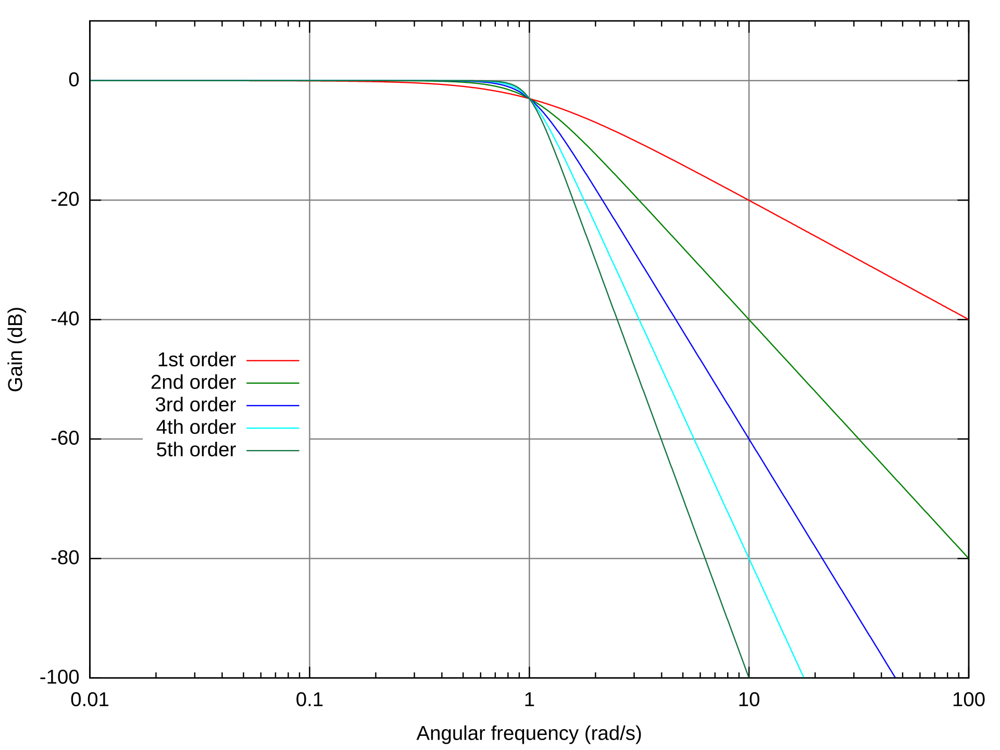
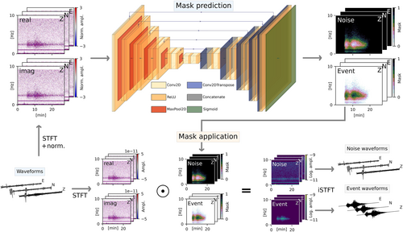

dsl-as24-challenge-3
==============================

AI-powered Earthquake Data Denoising

# Dataset
The dataset consists of 20'000 noise-free earthquake events and 20'000 pure noise events. The data was collected by the swiss seismological service (SED) http://seismo.ethz.ch/en/home/. 


# Butterworth

We use the bandpass butterworth filter as a baseline. We use `scipy.optimize.minimize` function to find the optimal values for the order and the lower and upper bound of the band. 



For running the training use

```
python main.py --butterworth --training True --signal_path 'path_to_signals' --noise_path 'path_to_noise'
```
. This function returns the optimized parameters `lowcut, highcut, order`. 


# Deep Denoiser

We implement the U-Net architecture from the DeepDenoiser paper https://github.com/AI4EPS/DeepDenoiser and MarsQ paper https://agupubs.onlinelibrary.wiley.com/doi/full/10.1029/2022JE007503 in keras and train it with the Swiss SED dataset. 

### Model 
The key idea of the model is to first transform the one-dimensional noisy earthquake trace with the short-time-fourier-transform. This computation yields a two-dimensional signal, that is passed to a standard U-Net architecture, which learns to predict a two-dimensional mask with equal shape as the STFT shape. This mask has entries with values in $[0,1]$. To denoise the noisy earthquake trace, we simply have to multiply the mask with the STFT of the noisy earthquake trace and use the inverse STFT to get back to the time domain.


### Combining Signal & Noise
We normalize the signal and noise by first computing the original signal-to-noise ratio and then multiplying the noise with this original signal-to-noise ratio. This ensures that the signal-to-noise ratio of the original earthquake signal and the scaled noise has $snr = 1$. This follows from the properties of the standard deviation. Let $E$ be the earthquake sequence and $N$ the noise sequence. We have $a = \frac{std(E)}{std(N)}$ and $snr = \frac{std(E)}{std(a * N)} = \frac{std(E)}{\sqrt{Var(a \cdot N)}} = \frac{std(E)}{a\sqrt{Var(N)}} = \frac{std(E)}{\frac{std(E)}{std(N)}\cdot std(N)} = 1$      
```
signal_std = signal[6000:6500].std()
noise_std = noise[6000:6500].std()
snr_original = signal_std / noise_std

noise_normalized = noise * snr_original
```
Then the combine the noise and earthquake, where we specify the desired signal-to-noise ratio. 

```
noisy_eq = signal + ratio * normalized_noise
```
The combination of signal and noise is the input to our U-Net architecture.
We also have to create the ground-truth masks. These are defined as in https://agupubs.onlinelibrary.wiley.com/doi/full/10.1029/2022JE007503 by first computing the short-time-forier-transform (STFT) of the signal and the noise. We use a frame length of $100$, a frame step $24$ and fft size $126$ with trace length of $6120$. This results in an output shape of $(256,64)$. The dimensions are exactly a power of two, which is an ideal input shape for the U-Net architecture.

```
stft_signal = keras.ops.stft(signal, 100, 24, 126)
stft_noise = keras.ops.stft(noise, 100, 24, 126)
```
The masks are defined as 
```
mask = np.abs(stft_signal) / (np.abs(stft_signal) + np.abs(stft_noise) + 1e-4)
```
which is exactly the ratio of the signal and noise power computed for each $(t,f)$ time-frequency domain entry of the stft. In the end we get an output shape $(6,256,64)$ since we have three channels $\{Z,N,E\}$ and for each of them the stft returns a real and imaginary part.


# Cold Diffusion

We use the model from the Cold Diffusion Model for Seismic Signal Denoising paper https://github.com/Daniele-Trappolini/Diffusion-Model-for-Earthquake/tree/main/CDiffSD/utils. The proposed architecture uses the cold diffusion method to iteratively denoise a noisy earthquake signal. 
### Model 
TODO: Write about Cold Diffusion model

### Data Normalization
The signal and noise traces are normalized differently than for the U-Net. The authors of the ColdDiffusion paper propose to scale the traces by the maximum absolute value over the complete trace. 
```
signal_normalized = signal / signal.abs().max()
noise_normalized = noise / noise.abs().max()
```
To create the noisy input trace, they also rely on sampling, but use a discrete uniform distribution $U(\{40, ..., 60\}$ and then multiply the sampled integer by $0.01$. 
```
reduce_noise = random.randint((40,60)) * 0.01
noisy_eq = signal_normalized + reduce_noise *noise_normalized
```

